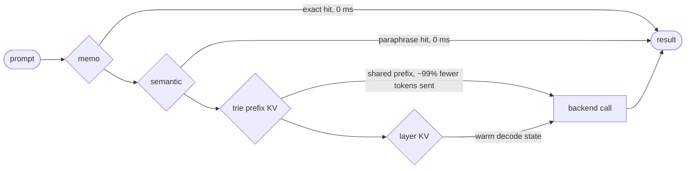

# Continuum

<p align="center">
  <a href="https://github.com/rithulkamesh/continuum/actions/workflows/ci.yml">
    
  </a>
  <a href="https://pypi.org/project/continuum-ai/">
    
  </a>
  <a href="https://pypi.org/project/continuum-ai/">
    =3.10" src="https://img.shields.io/pypi/pyversions/continuum-ai.svg">
  </a>
  <a href="./LICENSE">
    
  </a>
  <a href="https://ct.rithul.dev/python/">
    
  </a>
  <a href="https://ct.rithul.dev/cpp/">
    
  </a>
</p>

**The AI runtime that never computes the same thing twice, and never loses its place.**

Agent workflows burn money recomputing what they already know: the same system
prompt tokenized ten thousand times, the same subtask answered again, an
hour-long run lost to one crash at step 19. Continuum is a C++ execution engine
that treats LLM calls and tensor ops as operators in one dataflow graph.
Redundant work is cached at the runtime level, and a running workflow can be
checkpointed to bytes, resumed in another process, or forked from any past step.



- **92.5% token reduction** on a mixed 20-step agent workload against live Azure OpenAI.
- **Zero-cost exact repeats.** Memoized calls skip the backend entirely.
- **Durable execution.** Checkpoint, crash, resume, and time-travel fork, with deterministic replay.
- **One graph for tokens and tensors.** Azure, OpenAI, Anthropic, vLLM, libtorch, and MLX behind one IR.

## Quick Start

```bash
python -m pip install continuum-ai
```

Kill an agent mid-run and finish it in a different process:

```python
from continuum._native import DurableAgent

agent = DurableAgent()
agent.begin(["research the topic", "draft the report", "publish it"])
ckpt = agent.run_until_step(1)        # bytes: graph + every value + KV cache state

# ... process dies here ...

revived = DurableAgent()              # brand-new runtime
outputs = revived.resume_from(ckpt)   # completes steps 3+ without redoing 1-2
```

Rewind a finished run, edit one step, and replay the alternate timeline:

```python
forked = DurableAgent.fork(ckpt, node_id, "write a haiku instead")
alternate = DurableAgent().resume_from(forked)
```

See every reuse tier fire in one deterministic run:

```bash
PYTHONPATH=python python examples/01_reuse_stack.py   # --trace for per-tier firing
PYTHONPATH=python python examples/02_durable_agent.py           # checkpoint / crash / resume
PYTHONPATH=python python examples/03_time_travel_fork.py        # rewind, edit, replay
```

## Results

Against a live Azure OpenAI backend, isolated per tier:

- Trie prefix KV cache: ~99% token reduction on a 3,000-char shared prefix.
- Memo table: 5/5 exact-repeat backend calls skipped.
- Mixed 20-step workflow: 92.5% token reduction, 4/20 backend calls eliminated.

Full tables, latency notes, and the scripts behind every number are in
[`docs/benchmarks.md`](docs/benchmarks.md), with raw data and reports under
[`benchmarks/`](benchmarks/).

## What Is Implemented

- C++ execution engine with an IR interpreter and serializable checkpoints.
- Five-tier reuse stack: trie prefix KV cache, memo table, semantic cache, layer KV warm-start, memory graph recall.
- Durable execution: checkpoint a running workflow to bytes, resume in a fresh process with the KV cache included, or fork from a past step with an edited value.
- Session API with per-tier reuse policies and cross-session cache persistence.
- Backends: Azure OpenAI, OpenAI, Anthropic, vLLM shim, libtorch, MLX, and a deterministic FakeLLM for CI.

## Current Status

- v1 release hardening in progress.
- CIR schema lock with serialization conformance (`schema/cir.fbs`).
- Linux and macOS CI matrix with coverage gates and a fuzz workflow.
- PyPI packaging under `continuum-ai`. Import path remains `continuum`.

## Learn More

- [How Continuum fits with what you already use](docs/comparison.md), plus what you can build and why it is a runtime, not a wrapper.
- [Design docs](docs/README.md): [architecture](docs/design/overview.md), [runtime model](docs/design/runtime.md), [cache semantics](docs/design/cache.md), [IR](docs/design/ir.md).
- [Benchmarks](docs/benchmarks.md).
- [Building the docs](docs/building-docs.md).
- Hosted API docs: [Python](https://ct.rithul.dev/python/), [C++](https://ct.rithul.dev/cpp/).

## Contributing

- [Contributing guide](.github/CONTRIBUTING.md)
- [Code of Conduct](.github/CODE_OF_CONDUCT.md)
- [Security policy](.github/SECURITY.md)
- [Support guide](.github/SUPPORT.md)
- [Governance](.github/GOVERNANCE.md)

```bash
pip install pre-commit
pre-commit install
pre-commit run --all-files
pytest
```

## Citation

```bibtex
@software{continuum2026,
  title        = {Continuum: Unified Runtime for Token and Tensor Programs},
  author       = {Kamesh, Rithul and Contributors},
  year         = {2026},
  url          = {https://github.com/rithulkamesh/continuum},
  version      = {1.0.0}
}
```
