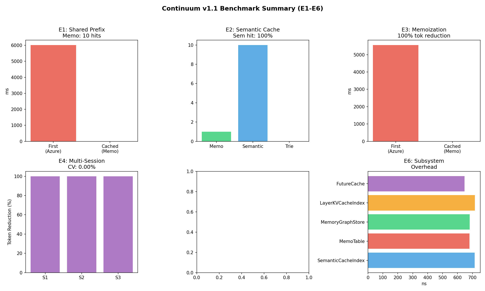

# Benchmarks

Isolated per-tier benchmarks against a live Azure OpenAI backend (gpt-5-mini),
one reuse mechanism enabled at a time. Runner scripts live in
[`benchmarks/scripts/`](../benchmarks/scripts/), raw data in
[`benchmarks/data/`](../benchmarks/data/), plots in
[`benchmarks/plots/`](../benchmarks/plots/), and the written reports in
[`benchmarks/reports/`](../benchmarks/reports/).

| Mechanism | Workload | Result |
|---|---|---|
| Trie prefix KV cache | 10 calls, 3,000-char shared prefix | ~99% token reduction (9/9 hits, ~30 tokens sent per call) |
| Memo table | 5 exact-repeat tool calls | 5/5 backend calls skipped, 0 ms |
| Mixed 20-step agent workflow | prefix + repeats + paraphrases + cold queries | 92.5% token reduction, 4/20 backend calls eliminated |
| Cross-session cold start | persist cache metadata, restart, reload | >=80% hit rate on first warm run |
| No-reuse worst case | 4 unrelated queries | ~0.5% overhead, no errors |
| Memory-graph recall (isolated, offline) | 12-turn labeled log, 8 follow-ups; 128 to 8,192 nodes | top-1 on-topic 8/8, precision@3 0.58 at the 0.7 default; 3.4 ms p50 lookup at 8,192 nodes ([report](../benchmarks/reports/memory-graph-recall.md)) |

## Notes

Latency on prefix hits drops ~31% (5.4 s to 3.7 s median). The API round-trip
dominates once 99% of prompt tokens are skipped, so token cost is where reuse
pays, not wall-clock time.

The bundled n-gram embedding provider is a placeholder. Semantic-tier results
require a real embedding model and are excluded from the headline numbers.

Deterministic, CI-checked versions of every mechanism run offline via the
FakeLLM backend (`examples/`, `tests/python/`).
