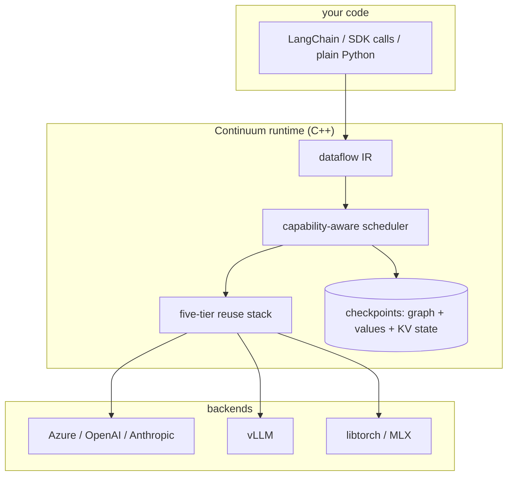

# How Continuum Fits With What You Already Use

Continuum sits below your framework, not beside it. LangChain or LangGraph
code, raw SDK calls, and plain Python all route through the same runtime.

| You may already use | What it gives you | What Continuum adds |
|---|---|---|
| Provider prompt caching (OpenAI, Anthropic) | Prefix discounts inside one provider, TTL-bound | Provider-agnostic reuse, plus memo and semantic tiers, plus cache state you own |
| GPTCache or LangChain cache | App-layer response cache | Runtime-level reuse with defined invalidation semantics, so tool calls are never served stale |
| LangGraph checkpointing or Temporal | Workflow state persistence and retries | Checkpoints that carry the KV cache too: resume warm, deterministic replay, fork any past step |
| vLLM prefix caching | KV reuse on GPUs you operate | The same idea extended across hosted APIs, portable inside checkpoints |

## What You Can Build

- **Agents that survive anything.** Checkpoint mid-run, resume on another
  machine with the KV cache still warm, through deploys, crashes, and
  spot-instance eviction.
- **Cheaper agent fleets.** Hundreds of sessions sharing one system prompt
  send it once. The trie prefix cache serves the rest.
- **Eval and CI loops.** Re-running near-identical prompt suites hits the memo
  and prefix tiers instead of your API budget.
- **Time-travel debugging.** Rewind a finished run, edit step 7, replay the
  alternate timeline. Completed steps come from the checkpoint, never
  recomputed.
- **Hybrid pipelines.** Hosted LLM calls and local tensor ops (libtorch, MLX)
  as operators in the same scheduled graph.

## Why a Runtime, Not a Wrapper

Caching bolted onto an SDK cannot know what is safe to reuse. Continuum sits
below the program, where reuse has defined semantics.

- **Correct invalidation.** Tool calls are never served from cache because they
  have side effects. Memoized results are version-bumped on resume. Cached KV
  state is reused only when its tokens are verifiably a prefix of the query.
- **Policy-gated.** Every tier respects a per-session `ReusePolicy` (`always`,
  `never`, or a prefix-length threshold). One switch, no stale reads.
- **Portable state.** Backends that can export their state handles carry the KV
  cache inside the checkpoint, so a resumed process starts warm, not cold.
- **Capability dispatch.** Backends declare tensor, token, and cache
  capabilities. The scheduler routes each node and converts tensors across
  backends explicitly.

